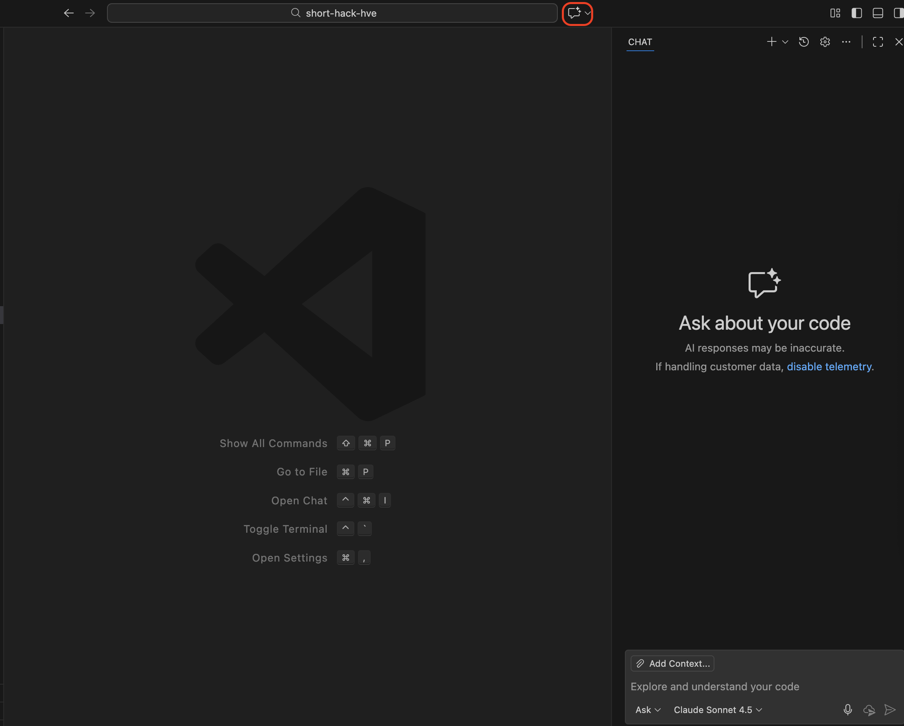
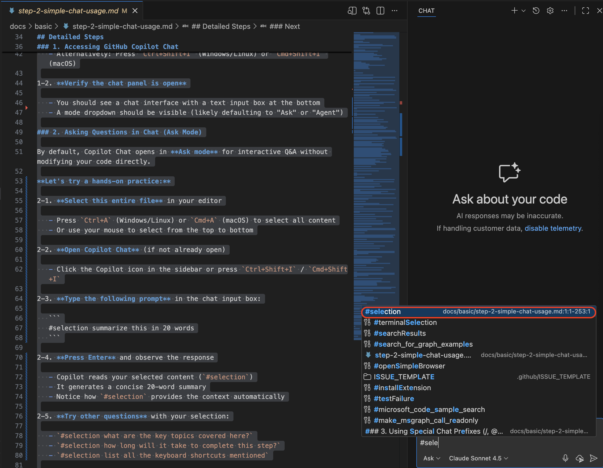
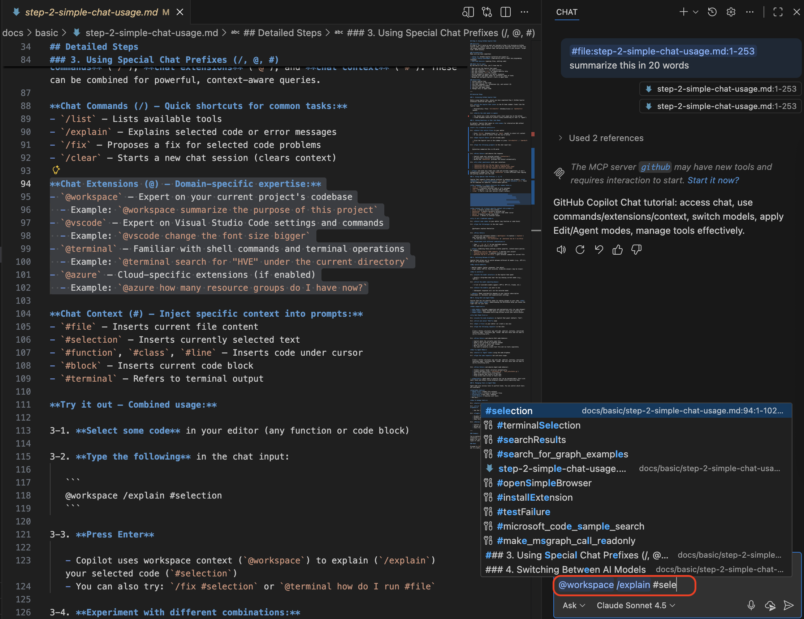
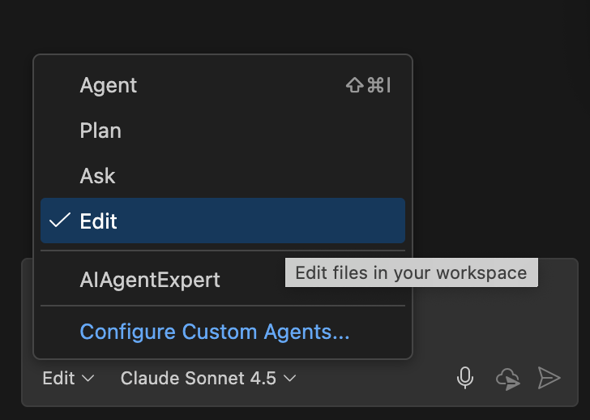
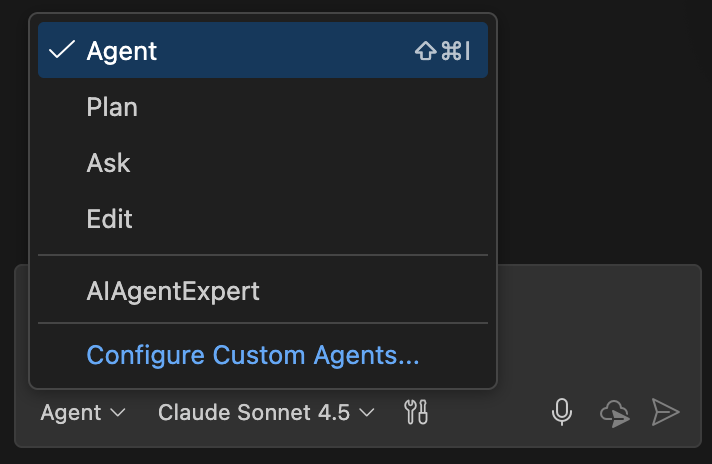
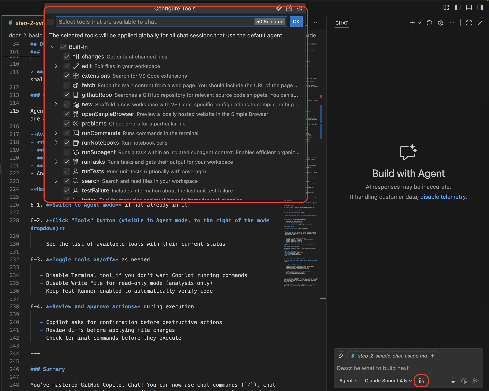

## ステップ 2: GitHub Copilot Chat を使う

### 概要
ステップ 2 では、ステップ 1 の学習内容を踏まえて GitHub Copilot Chat にフォーカスします。Copilot Chat は VS Code 内のインタラクティブな AI アシスタントで、質問への回答、コードの説明、プロジェクトでのタスク実行を支援します。所要時間の目安は 10〜20 分です。

### 事前条件
事前に以下を完了しておいてください。

- **ステップ 1**（GitHub Copilot のインストールとサインイン）
- **基本的なコーディング知識**（少なくとも1つのプログラミング言語に慣れている）
- **VS Code の基本操作**（ファイルを開く、コードを編集するなど）

### 学ぶ内容
このステップの終了時点で、次のことができるようになります。

- Copilot Chat パネルを開いて利用する
- chat コマンド（`/`）でクイックアクションを実行する
- chat 拡張（`@`）でドメイン専門の支援を活用する
- chat コンテキスト（`#`）でコンテキストを指定する
- 回答のクオリティに応じて AI モデルを切り替える
- EditモードとAgentモードを使い分ける
- Agentモードで使用するツールを管理・設定する

### クイックフロー
1. Copilot Chat にアクセスする
2. Chat で質問する
3. Chat コマンド（/）、拡張（@）、コンテキスト（#）を使う
4. AI モデルを切り替える
5. EditモードとAgentモードを利用する
6. Agentモードのツールを管理する

---

## 詳細手順

### 1. GitHub Copilot Chat にアクセスする

Copilot Chat を使う前に、ステップ 1（Copilot 拡張のインストールとサインイン）を終えていることを確認してください。

1-1. **VS Code サイドバーの Copilot Chat アイコン**（Copilot ロゴ）をクリックします。

   - もしくはショートカット `Ctrl+Shift+I`（Windows/Linux）または `Cmd+Shift+I`（macOS）を使います。

1-2. **チャットパネルが開いているか確認**します。

   - 下部にテキスト入力ボックスがあるチャットインターフェースが表示されます。
   - モードのドロップダウン（通常 "Ask" または "Agent"）が見えるはずです。



### 2. Chat で質問する（Ask モード）

Copilot Chat は標準で **Ask モード** で開きます。これはコードを直接変更せずに対話形式で Q&A を行うモードです。

**ハンズオン演習:**

2-1. **エディターでこのファイル全体を選択**します。

   - `Ctrl+A`（Windows/Linux）または `Cmd+A`（macOS）で全選択
   - あるいはマウスで冒頭から末尾までドラッグ

2-2. **Copilot Chat を開く**（まだの場合）。

   - サイドバーの Copilot アイコンをクリック、または `Ctrl+Shift+I` / `Cmd+Shift+I`

2-3. **チャット入力欄に次のプロンプトを入力**します。

   ```
   #selection 100字以内で要約してください
   ```


2-4. **Enter キーを押してレスポンスを確認**します。

   - Copilot は選択した内容（`#selection`）を読み込みます。
   - 100字の簡潔な要約を生成します。
   - `#selection` によってコンテキストが自動的に渡される点に注目してください。

2-5. **選択範囲に対して他の質問も試してみましょう。**

- `#selection ここでカバーされている主要なトピックは何ですか？`
- `#selection このステップを完了するのにどのくらい時間がかかりますか？`
- `#selection 記載されているすべてのキーボードショートカットを一覧表示してください`

> **Tip:** Ask モードはコードを読み取り提案を返しますが、ファイルを自動で変更しません。内容を Chat にコピー＆ペーストするより `#selection` を使うほうが効率的です。

### 3. 特殊プレフィックス（/、@、#）を使う

Copilot Chat では、プロンプトを強化する 3 種類の特殊プレフィックスが使えます。**chat コマンド（`/`）**、**chat 拡張（`@`）**、**chat コンテキスト（`#`）** です。組み合わせることで強力なコンテキスト指向のクエリが作れます。

**Chat コマンド（/）— よく使うタスクへのショートカット:**
- `/list` – 利用可能なツールを一覧表示
- `/explain` – 選択したコードやエラーを説明
- `/fix` – 選択したコードの問題に対する修正案を提示
- `/clear` – 新しいチャットセッションを開始（コンテキストをリセット）
**Chat 拡張（@）— ドメイン固有の専門知識を呼び出す:**
- `@workspace` – 現在のプロジェクト全体に詳しいアシスタント
   - 例: `@workspace このプロジェクトの目的を要約してください`
- `@vscode` – VS Code の設定やコマンドに詳しいアシスタント
   - 例: `@vscode フォントサイズを大きくしてください`
- `@terminal` – シェルコマンドやターミナル操作に詳しいアシスタント
   - 例: `@terminal 現在のディレクトリ中に "HVE" を検索してください`
- `@azure` – Azure 系拡張（有効な場合）
   - 例: `@azure 現在いくつのリソースグループがありますか？`

**Chat コンテキスト（#）— プロンプトに文脈を挿入:**
- `#file` – 現在のファイルの内容を挿入
- `#selection` – 現在選択中のテキストを挿入
- `#function`、`#class`、`#line` – カーソル位置のコードを挿入
- `#block` – 現在のコードブロックを挿入
- `#terminal` – ターミナル出力を参照

**組み合わせ例:**

3-1. **エディターでコードを選択**（任意の関数やブロック）。

3-2. **チャット入力欄に次を入力**します。

   ```
   @workspace /explain #selection
   ```



3-3. **Enter キーを押す**:

   - Copilot はプロジェクトコンテキスト（`@workspace`）を活用し、`/explain` で選択コード（`#selection`）を説明します。
   - 他にも `/fix #selection` や `@terminal how do I run #file` を試せます。

3-4. **さまざまな組み合わせを試しましょう。**

   - 入力欄で `/`、`@`、`#` を押すと利用可能な候補が表示されます。
   - ニーズに合わせて組み合わせてください。

> **Tip:** プレフィックスを組み合わせると強力なコンテキスト指向のクエリが作れます。
> - `@workspace 全ての TODO コメントを探してください` — プロジェクト内検索
> - `/explain #selection` — 選択コードの説明
> - `@terminal どうやって動けるのですか？ #file` — 現在のファイルを実行するコマンドを取得

### 4. AI モデルを切り替える

Copilot Chat では複数の AI モデル（例: GPT-3.5、GPT-4）を用途に応じて切り替えられます。

**モデルを切り替える理由:**

- 小さいモデル: 応答が速いが詳細は少なめ
- 大きいモデル（GPT-4 など）: 応答が精緻で詳細（ただし遅くなる場合あり）

**切り替え手順:**

4-1. **チャットパネル内のモデルセレクター** を探します。

   - 通常は上部にドロップダウンがあり、現在のモデル名（例: "GPT-4"）が表示されます。

4-2. **モデル名／ドロップダウンをクリック**します。

   - 利用可能なモデルの一覧（GPT-4、GPT-3.5、Claude など）が表示されます。

4-3. **使用したいモデルを選択**します。

   - 以後の応答は選択したモデルで生成されます。

> **Note:** 利用可能なモデルは Copilot の契約プラン（Individual / Business）や組織設定によって異なります。

### 5. Edit モードと Agent モードを使う

Copilot Chat にはコード変更用に 2 つの強力なモードがあります。**Edit モード** と **Agent モード** です。違いを理解し、タスクに応じて適切なモードを選びましょう。

**モード比較:**

- **Ask モード**: 提案や説明のみを返し、コード変更は行わない
- **Edit モード**: 作業中の特定ファイルに対してピンポイントで修正する
- **Agent モード**: プロジェクト全体を横断する複数ステップの自動処理が可能

**まずは Edit モードを試す:**

5-1. **チャットパネルのモードドロップダウン**（初期値は "Ask"）を表示します。

5-2. **"Edit" を選択**します。



5-3. **エディターでファイルを開く**（または新規作成）。

5-4. **以下のリクエストをチャットに入力**します。

   ```
   `calculator_app` フォルダー配下に、加算・減算・乗算・除算の機能を持つ Python 電卓アプリを作成してください。ユニットテストを追加し、すべてが正しく動作することを確認するためにテストを実行してください。
   ```

5-5. **Enter キーを押して Edit モードの挙動を確認**します。

   - Copilot は現在開いているファイルに修正案を提示
   - 変更差分（diff）がプレビュー表示される
   - 変更を受け入れるか拒否するか選べる
   - 1 回につき 1 ファイルへの編集が対象
   - テストファイルの作成やテスト実行は手動で行う必要あり

**次に Agent モードを試す:**

5-6. **モードドロップダウンから "Agent" を選択**します。



5-7. **同じリクエストを入力**してみましょう。

   ```
   `calculator_app` フォルダー配下に、加算・減算・乗算・除算の機能を持つ Python 電卓アプリを作成してください。ユニットテストを追加し、すべてが正しく動作することを確認するためにテストを実行してください。
   ```

5-8. **Enter キーを押し、Agent モードの挙動を観察**します。

   - プロジェクトのフォルダー構成を自動で作成
   - 複数のファイル（`calculator.py`、`test_calculator.py` など）を生成
   - `pytest` でテストを自動実行
   - チャット内で進捗と結果を表示
   - テスト失敗時は修正して再実行

> **Important:** Agent モードは強力ですが予測不能な場合があります。小さなタスクから始め、提案された変更を必ずレビューしてから適用してください。

### 6. Agent モードでツールを管理する

Agent モードはタスク実行のために複数のツールを利用します。利用可能なツールを制御して安全に運用しましょう。

**利用可能なツール例:**
- **Read File** – ファイル内容を読み取る
- **Write File** – ファイルを作成・変更する
- **Terminal** – シェルコマンドを実行する
- **Test Runner** – ユニットテストを実行する
- そのほか拡張機能で追加されたツール

**ツール管理手順:**

6-1. **Agent モードに切り替えていることを確認**します。

6-2. **モードドロップダウン右側の "Tools" ボタン**をクリックします。

   - 利用可能なツール一覧と現在のオン／オフ状態が表示されます。



6-3. **必要に応じてツールを切り替え**ます。

   - ターミナルコマンド実行を避けたい場合は Terminal ツールを無効化
   - 読み取り専用で分析したい場合は Write File を無効化
   - コード検証を自動化するなら Test Runner を有効化

6-4. **実行中のアクションをレビューして承認**します。

   - 破壊的な操作の前には確認が求められます。
   - ファイル変更の diff を確認してから適用します。
   - 実行予定のターミナルコマンドをチェックします。

---

### まとめ

GitHub Copilot Chat の使い方をマスターしました。chat コマンド（`/`）、chat 拡張（`@`）、chat コンテキスト（`#`）を活用してコンテキスト指向の支援を得る方法、目的に応じた AI モデルの切り替え、そして Edit / Agent モードによるコード変更とそのツール管理ができるようになりました。

### 次のステップ

[ステップ 3: GitHub Copilot をカスタマイズする](./step-3-chat-customization.md) に進み、プロジェクト向けのカスタム指示とカスタムエージェントを作成しましょう。
