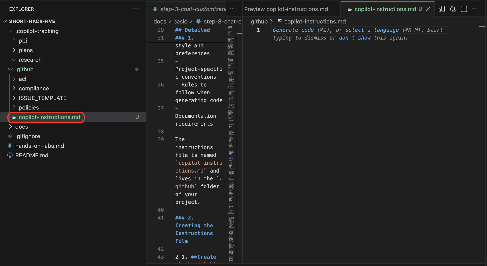
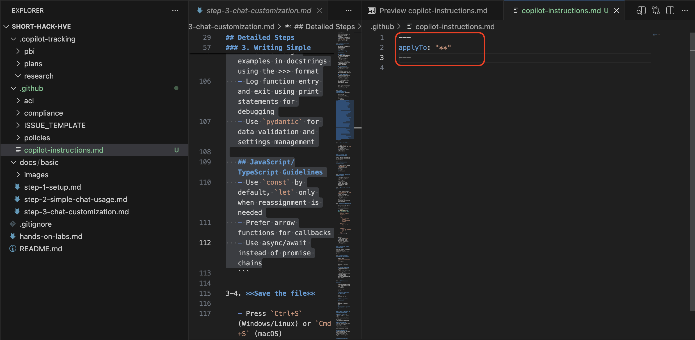
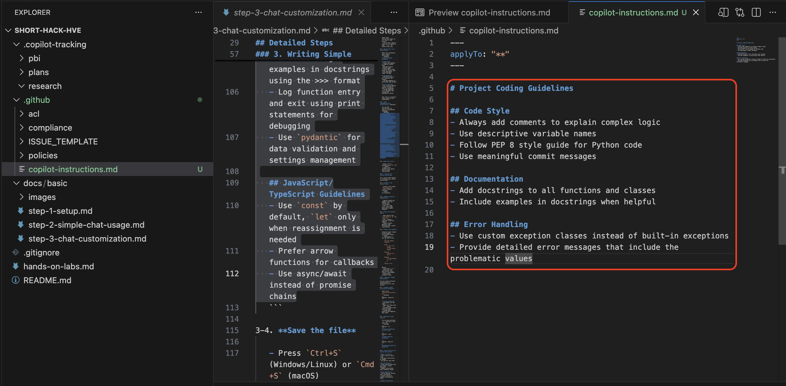
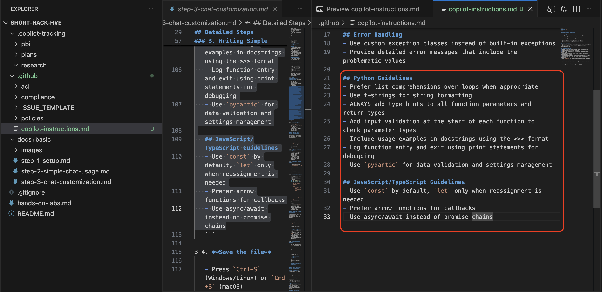
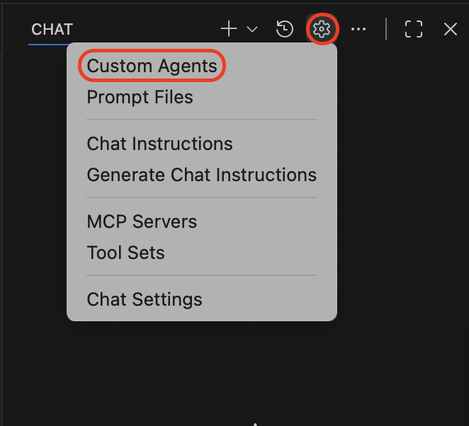
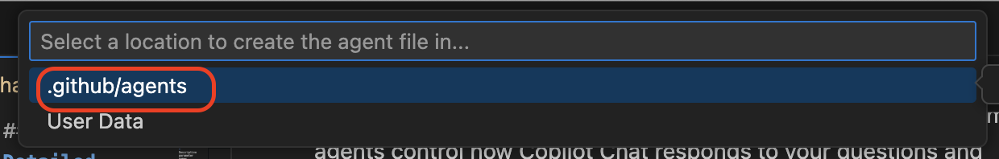

## Step 3: Customizing GitHub Copilot

### Overview
In Step 3, we'll learn how to customize GitHub Copilot's behavior. You'll discover how to create custom instructions for your project and set up reusable custom agents for specialized assistance. Target time: 10–20 minutes.

### Prerequisites
Make sure you have completed:

- **Step 1** (GitHub Copilot installed and signed in)
- **Step 2** (Familiar with Copilot Chat basics)
- **VS Code basics** (opening files, editing code, creating folders)

### What You'll Learn
By the end of this step, you'll know how to:

- Create custom instruction files for your project
- Write effective instructions for Copilot
- Create reusable custom agents for specific tasks
- Switch between different custom agents

### Quick Flow
1. Create custom instructions file
2. Write and test instructions
3. Create custom agents
4. Test and use custom agents

---

## Detailed Steps

### 1. Understanding Custom Instructions

GitHub Copilot can read custom instructions from a special file in your project. These instructions help Copilot understand:
- Your coding style and preferences
- Project-specific conventions
- Rules to follow when generating code
- Documentation requirements

The instructions file is named `copilot-instructions.md` and lives in the `.github` folder of your project.

### 2. Creating the Instructions File

2-1. **Create the `.github` folder** (if it doesn't exist)

   - In VS Code Explorer, right-click on your project root
   - Select "New Folder"
   - Name it `.github`

2-2. **Create the instructions file**

   - Right-click on the `.github` folder
   - Select "New File"
   - Name it `copilot-instructions.md`

   Your file path should be: `.github/copilot-instructions.md`  
   

### 3. Writing Simple Custom Instructions

Now let's add some basic instructions to guide Copilot's behavior.

3-1. **Add the frontmatter header**

   At the top of `copilot-instructions.md`, add:
   ```markdown
   ---
   applyTo: "**"
   ---
   ```

   - The `applyTo: "**"` means these instructions apply to all files in the project
   - You can also specify specific file patterns like `"*.py"` for Python files only

   

3-2. **Write your first instruction**

   Below the frontmatter, add a simple instruction:
   ```markdown
   # Project Coding Guidelines

   ## Code Style
   - Always add comments to explain complex logic
   - Use descriptive variable names
   - Follow PEP 8 style guide for Python code
   - Use meaningful commit messages

   ## Documentation
   - Add docstrings to all functions and classes
   - Include examples in docstrings when helpful
   
   ## Error Handling
   - Use custom exception classes instead of built-in exceptions
   - Provide detailed error messages that include the problematic values
   ```

   Feel free to customize these based on your preferences!

   

3-3. **Add language-specific instructions** (optional)

   You can add instructions for specific programming languages:
   ```markdown
   ## Python Guidelines
   - Prefer list comprehensions over loops when appropriate
   - Use f-strings for string formatting
   - ALWAYS add type hints to all function parameters and return types
   - Add input validation at the start of each function to check parameter types
   - Include usage examples in docstrings using the >>> format
   - Log function entry and exit using print statements for debugging
   - Use `pydantic` for data validation and settings management

   ## JavaScript/TypeScript Guidelines
   - Use `const` by default, `let` only when reassignment is needed
   - Prefer arrow functions for callbacks
   - Use async/await instead of promise chains
   ```

   
3-4. **Save the file**

   - Press `Ctrl+S` (Windows/Linux) or `Cmd+S` (macOS)
   - Copilot will automatically detect and use these instructions

### 4. Testing Your Custom Instructions

Let's verify that Copilot is following your custom instructions.

4-1. **Test with Copilot Chat**

   - Open Copilot Chat (`Ctrl+Shift+I` or `Cmd+Shift+I`)
   - Ask: "Create a function to add two numbers"
   - Copilot should generate code following your custom instructions

4-2. **Verify the output**

   Expected result (based on the example instructions above):
   ```python
   def add_numbers(a: int, b: int) -> int:
       """
       Add two numbers together.
       
       Args:
           a: The first number
           b: The second number
           
       Returns:
           The sum of a and b
           
       Example:
           >>> add_numbers(2, 3)
           5
       """
       return a + b
   ```

   Notice:
   - Type hints (`int`)
   - Docstring with description, args, returns, and example
   - Descriptive parameter names

### 5. Advanced: Scoped Instructions

You can create different instructions for different parts of your project.

5-1. **Create scoped instruction sections**

   Add to your `copilot-instructions.md`:
   ```markdown
   ---
   applyTo: "tests/**"
   ---

   # Testing Guidelines
   - Use pytest for all tests
   - Name test files with `test_` prefix
   - Use descriptive test function names
   - Include both positive and negative test cases
   ```

5-2. **Multiple scope blocks**

   You can have multiple `---` sections in the same file:
   ```markdown
   ---
   applyTo: "**"
   ---
   # General guidelines for all files

   ---
   applyTo: "*.py"
   ---
   # Python-specific guidelines

   ---
   applyTo: "docs/**"
   ---
   # Documentation-specific guidelines
   ```

### 6. Best Practices for Custom Instructions

**Keep it simple:**
- Start with 3-5 basic rules
- Add more instructions as needed
- Be specific and clear

**Be consistent:**
- Align instructions with your team's coding standards
- Update instructions when standards change

**Test regularly:**
- Verify Copilot follows your instructions
- Adjust wording if Copilot misinterprets rules

**Common instruction topics:**
- Code style and formatting
- Naming conventions
- Documentation requirements
- Error handling patterns
- Testing approaches
- Security considerations

### 7. Creating Custom Agents

Custom agents are reusable personas for Copilot Chat that enable you to configure the AI for specific development roles and tasks. Unlike custom instructions (which affect code generation), custom agents control how Copilot Chat responds to your questions and which tools are available.

> **Note**: Custom agents were previously known as "custom chat modes". If you have existing `.chatmode.md` files in `.github/chatmodes`, VS Code will still recognize them, and you can also rename and move them to the new `.github/agents` folder with a `.agent.md` extension.

7-1. **Open custom agents configuration**

   - Open the Copilot Chat panel
   - Click on the agent selector dropdown (at the top of the chat panel)
   - Select "Configure Custom Agents" from the dropdown menu



7-2. **Create a new custom agent**

   - Click "Create new custom agent" or run the command `Chat: New Custom Agent` from the Command Palette (`Ctrl+Shift+P` or `Cmd+Shift+P`)
   - Choose the location:
     - **Workspace**: Create in `.github/agents` folder (only for this project)
     - **User profile**: Create in your profile folder (use across all workspaces)
   - Enter a file name for your custom agent (e.g., `code-reviewer`)



7-3. **Name and describe the agent**

   VS Code creates a `.agent.md` file with a template:
   ```markdown
   ---
   description: 'Describe what this custom agent does and when to use it.'
   tools: []
   ---
   Define what this custom agent accomplishes for the user, when to use it, and the edges it won't cross. Specify its ideal inputs/outputs, the tools it may call, and how it reports progress or asks for help.

   ```

   Fill in the details:
   - **description**: `Provides code review feedback instead of direct answers`

7-4. **Understanding custom agent header fields**

   The header section (YAML frontmatter) in a custom agent file supports multiple configuration options. Here's what you can include:

   **Core Fields:**
   - **`description`**: Brief description shown as placeholder text in the chat input field when this agent is active
   - **`name`**: The display name of the custom agent (if not specified, the filename is used)
   - **`argument-hint`**: Optional hint text to guide users on how to interact with the agent

   **Tool Configuration:**
   - **`tools`**: Array of tool names available to this agent. Can include:
     - Built-in tools: `'search'`, `'fetch'`, `'usages'`, `'edit'`, etc.
     - MCP server tools: Use `'<server-name>/*'` to include all tools from an MCP server
     - Extension-contributed tools
     - If a tool isn't available, it's simply ignored

   **Advanced Options:**
   - **`model`**: Specify which AI model to use (e.g., `'Claude Sonnet 4'`). If not set, uses the currently selected model
   - **`target`**: Target environment (`'vscode'` or `'github-copilot'`)
   - **`mcp-servers`**: List of Model Context Protocol server configurations (for GitHub Copilot target)
   - **`handoffs`**: Define workflow transitions to other agents (see section 7-6 for details)

   **Example with multiple fields:**
   ```markdown
   ---
   description: Provides code review feedback instead of direct answers
   name: CodeReviewer
   argument-hint: Include style guides or specific aspects to focus on
   tools: ['fetch', 'githubRepo', 'search', 'usages']
   model: Claude Sonnet 4
   ---
   ```

7-5. **Define the agent's instructions**

   Below the frontmatter, add your instructions:
   ```markdown
   You are a strict code review assistant. When the user provides code, analyze it and respond with constructive feedback on style, correctness, and best practices.
   
   - Point out any potential bugs or inefficiencies
   - Suggest improvements, but DO NOT rewrite the code unless asked
   - Use bullet points for each issue
   - Focus on security vulnerabilities, performance, and maintainability
   ```

   - Write in plain, clear language
   - Be specific about the behavior you want
   - You can reference tools using `#tool:<tool-name>` syntax

7-6. **Add handoffs for workflow transitions** (optional)

   Handoffs enable guided workflows between agents with suggested next steps. After a chat response, handoff buttons appear to transition to another agent with context and a pre-filled prompt.

   Add to the frontmatter:
   ```markdown
   ---
   description: Provides code review feedback instead of direct answers
   name: CodeReviewer
   argument-hint: Include style guides or specific aspects to focus on
   tools: ['fetch', 'githubRepo', 'search', 'usages']
   model: Claude Sonnet 4
   handoffs:
     - label: Fix Issues
       agent: agent
       prompt: Fix the issues identified in the code review above.
       send: false
   ---
   ```

   **Handoff fields:**
   - `label`: Text shown on the handoff button
   - `agent`: Target agent identifier to switch to
   - `prompt`: Pre-filled prompt text for the target agent
   - `send`: If `true`, auto-submits the prompt (default: `false`)

   **Common workflow examples:**
   - Planning → Implementation: Plan first, then hand off to implement
   - Implementation → Review: Code first, then hand off for quality check
   - Write Failing Tests → Make Tests Pass: Generate tests, then implement the code

7-7. **Save the agent file**

   - Press `Ctrl+S` (Windows/Linux) or `Cmd+S` (macOS)
   - VS Code registers the new custom agent
   - It now appears in the agent selector dropdown

### 8. Testing Your Custom Agent

8-1. **Activate the new agent**

   - In the Copilot Chat panel, find the agent selector dropdown (at the top)
   - Switch to your custom agent (e.g., `Code Reviewer`)

8-2. **Provide sample code for review**

   Example code:
   ```python
   # Sample code to review
   def add_numbers(a, b):
       result = a + b
       print("The result is", result)
       return result
   ```

   - Paste this into the chat input
   - Send it as a code block

8-3. **Ask for a review**

   Type: `Please review the code above for any issues or improvements.`

8-4. **Observe the code review response**

   Copilot should respond as a reviewer, for example:
   - Points out unnecessary `print()` statement in a library function
   - Suggests adding a docstring
   - Recommends type hints or input validation
   - Notes missing edge case handling

8-5. **Test with additional queries**

   While in Code Reviewer agent:
   - Paste different code snippets
   - Ask "What could be improved?"
   - Compare with responses when using the default agent

> **Tip**: Switch between agents to see different response styles. Your custom agents are saved and available anytime. If you created a workspace agent, others on your team can use it too!

---

### Summary

You've mastered GitHub Copilot customization! You can now create custom instructions in `.github/copilot-instructions.md` to guide code generation, and set up reusable custom agents for specialized assistance in Copilot Chat.

### Next

Continue exploring GitHub Copilot features and experiment with different instruction patterns and custom agents to find what works best for your projects!
