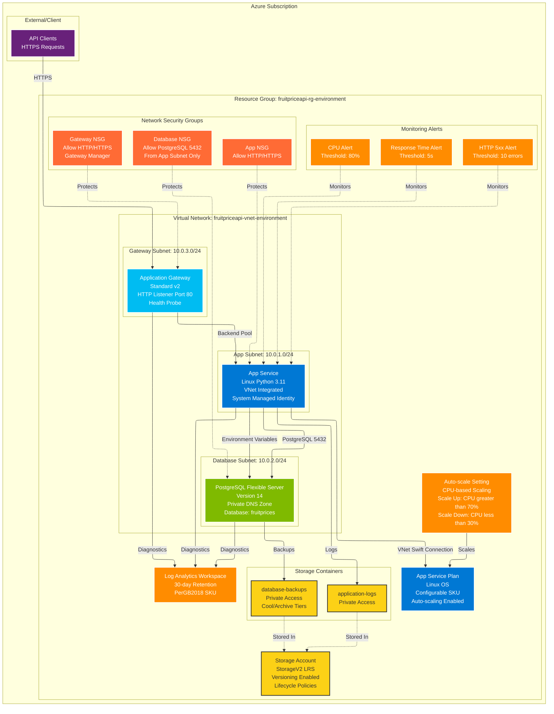

# Fruit Price API - Infrastructure Architecture

This diagram shows the complete Azure infrastructure for the Fruit Price API, including networking, compute, database, and monitoring components.



## Architecture Components

### Networking Layer
- **Virtual Network**: Isolated network with configurable address space (default: 10.0.0.0/16)
- **Subnets**: 
  - App Subnet with delegation to Microsoft.Web/serverFarms
  - Database Subnet with delegation to Microsoft.DBforPostgreSQL/flexibleServers
  - Gateway Subnet for Application Gateway
- **Network Security Groups**: Fine-grained security rules for each subnet
- **Service Endpoints**: Microsoft.Sql and Microsoft.Storage for secure access

### Compute Layer
- **App Service Plan**: Linux-based plan with configurable SKU (B1/S1/P1v3)
- **Linux Web App**: Python 3.11 runtime with Flask application
  - VNet integration for private communication
  - System-assigned managed identity
  - Health check endpoint: `/api/fruits/prices`
  - Auto-scaling based on CPU metrics
- **Application Gateway**: Standard_v2 tier with HTTP listener and health probes

### Database Layer
- **PostgreSQL Flexible Server**: Version 14 with VNet integration
  - Private DNS zone for secure connectivity
  - Configurable SKU (B_Standard_B1ms to GP_Standard_D4s_v3)
  - Automated backups with configurable retention (7-30 days)
  - Optional geo-redundant backups for production
- **Database Configuration**: Connection throttling and logging enabled

### Monitoring and Storage Layer
- **Log Analytics Workspace**: Centralized logging with 30-day retention
- **Storage Account**: StorageV2 with LRS replication
  - Application logs container with 7-day retention
  - Database backups container with lifecycle policies (Cool after 30 days, Archive after 90 days, Delete after 365 days)
- **Metric Alerts**: CPU, response time, HTTP errors monitoring

### Security
- **Network Security Groups**: Least-privilege access control
- **Private Endpoints**: Database accessible only from app subnet
- **HTTPS Only**: Enforced for all web traffic
- **Managed Identity**: System-assigned identity for secure Azure service access

## Environment Configuration

The infrastructure supports three environments with different resource sizes:

- **Development**: B1 App Service, B1ms PostgreSQL, 1-2 instances, 7-day backups
- **Staging**: S1 App Service, D2s_v3 PostgreSQL, 2-4 instances, 14-day backups
- **Production**: P1v3 App Service, D4s_v3 PostgreSQL, 3-10 instances, 30-day geo-redundant backups

## Deployment

Deploy the infrastructure using:

```bash
cd fruit_price_api/infra/terraform
terraform init
terraform plan -var-file=environments/dev.tfvars
terraform apply -var-file=environments/dev.tfvars
```
