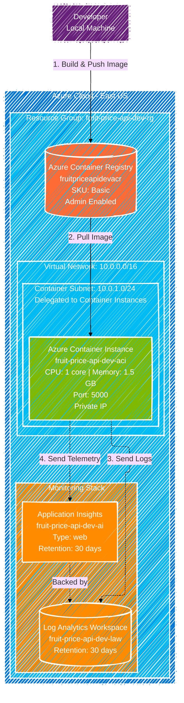

# Fruit Price API - Azure Infrastructure Architecture

This diagram represents the Azure infrastructure defined in the Terraform configuration for the development environment.

## Architecture Components

### Resource Group
- **Name**: `fruit-price-api-dev-rg`
- **Location**: East US
- **Purpose**: Logical container for all dev environment resources

### Networking
- **Virtual Network**: `fruit-price-api-dev-vnet`
  - Address Space: `10.0.0.0/16`
- **Container Subnet**: `container-subnet`
  - Address Prefix: `10.0.1.0/24`
  - Delegation: Microsoft.ContainerInstance/containerGroups

### Container Services
- **Azure Container Registry**: `fruitpriceapidevacr`
  - SKU: Basic
  - Admin Enabled: Yes (dev only)
  - Purpose: Private container image storage

- **Azure Container Instance**: `fruit-price-api-dev-aci`
  - OS Type: Linux
  - IP Address Type: Private (VNet integrated)
  - CPU: 1 core
  - Memory: 1.5 GB
  - Port: 5000
  - Purpose: Hosts the Flask API application

### Monitoring
- **Log Analytics Workspace**: `fruit-price-api-dev-law`
  - SKU: PerGB2018
  - Retention: 30 days
  - Purpose: Centralized log storage

- **Application Insights**: `fruit-price-api-dev-ai`
  - Application Type: web
  - Retention: 30 days
  - Purpose: Application performance monitoring and telemetry

## Data Flow

1. **Container Image**: Built locally and pushed to Azure Container Registry (ACR)
2. **Container Instance**: Pulls image from ACR using admin credentials
3. **Network**: Container runs in private subnet with VNet integration
4. **Monitoring**: Container logs flow to Log Analytics Workspace
5. **Telemetry**: Application metrics sent to Application Insights

## Security

- Container instance uses private networking (VNet integration)
- ACR requires authentication for image pulls
- Admin credentials stored securely in Terraform state
- Monitoring keys marked as sensitive outputs

## Scalability Notes

This is a **development environment** configuration optimized for:
- Low cost
- Simple deployment
- Quick iteration cycles

For production, consider:
- Azure Kubernetes Service (AKS) instead of ACI
- Azure API Management for API gateway
- Private endpoints for ACR
- Network Security Groups (NSGs)
- Azure Key Vault for secrets management
